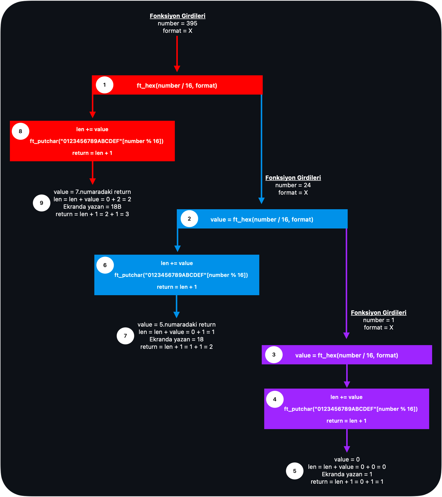

# ft_printf Projesi Notları

## İçerik
- [Mandatory Part](#mandatory-part)
- [Gerekli Dönüşümler Hakkında Kısa Açıklamalar](#gerekli-dönüşümler-hakkında-kısa-açıklamalar)
- [Değişken Sayıda Argüman Alan İşlevler (Varyadic Functions) Nedir?](#değişken-sayıda-argüman-alan-i̇şlevler-varyadic-functions-nedir)
- [Varyadic Functions Nasıl Kullanılır?](#varyadic-functions-nasıl-kullanılır)
- [Recursive Fonksiyon](#recursive-fonksiyon)
- [Fonksiyon Açıklamaları](#fonksiyon-açıklamaları)
	- [ft\_printf.c : `int ft_printf(const char *format, ...)`](#ft_printfc--int-ft_printfconst-char-format-)
	- [ft\_printf.c : `va_list arg`](#ft_printfc--va_list-arg)
	- [ft\_printf.c : `va_start(arg, format)`](#ft_printfc--va_startarg-format)
	- [ft\_printf.c : `va_end(arg)`](#ft_printfc--va_endarg)
	- [ft\_printf.c : `va_arg(arg, (data_type))`](#ft_printfc--va_argarg-data_type)
	- [ft\_printf\_utils.c : `ft_putchar("0123456789abcdef"[number % 16])`](#ft_printf_utilsc--ft_putchar0123456789abcdefnumber--16)
	- [ft\_printf\_utils.c : Fonksiyonların `return` değerleri neden bir sayı?](#ft_printf_utilsc--fonksiyonların-return-değerleri-neden-bir-sayı)

<br></br>

# Mandatory Part

<html lang="en">
	<body>
		<table>
			<tr>
				<td><b>Program adı</b></td>
				<td>libftprintf.a</td>
			</tr>
			<tr>
				<td><b>Teslim edilecek dosyalar</b></td>
				<td>*.c, */*.c, *.h, */*.h, Makefile</td>
			</tr>
			<tr>
				<td><b>Makefile</b></td>
				<td>all, clean, fclean, re, bonus</td>
			</tr>
			<tr>
				<td><b>Harici fonksiyonlar</b></td>
				<td>malloc, free, write, va_start, va_arg, va_copy, va_end</td>
			</tr>
			<tr>
				<td><b>Libft kullanılabilir mi?</b></td>
				<td>Evet</td>
			</tr>
			<tr>
				<td><b>Açıklama</b></td>
				<td>Gerçek printf fonksiyonunu taklit eden ft_printf fonksiyonunu içeren bir kütüphane yazın</td>
			</tr>
			<tr>
				<td><b>ft_printf fonksiyonunu prototipi</b></td>
				<td>int ft_printf(const char *, ...);</td>
			</tr>
			<tr>
				<td><b>Fonksiyonun yapması gereken dönüşüm</b></td>
				<td>cspdiuxX%</td>
			</tr>
			<tr>
				<td><b>Kütüphaneyi oluşturmak için kullanılması gereken komut</b></td>
				<td>ar komutu</td>
			</tr>
		</table>
	</body>
</html>

<br></br>

# Gerekli Dönüşümler Hakkında Kısa Açıklamalar
<html>
	<body>
		<table>
			<tr>
				<td><b>%c</b></td>
				<td>tek bir karakter yazdırır.</td>
			</tr>
			<tr>
				<td><b>%s</b></td>
				<td>bir karakter dizisi yazdırır.</td>
			</tr>
			<tr>
				<td><b>%p</b></td>
				<td>Void * pointer argümanını hexadecimal biçiminde yazdırır.</td>
			</tr>
			<tr>
				<td><b>%d</b></td>
				<td>10 tabanında decimal sayı yazdırır.</td>
			</tr>
			<tr>
				<td><b>%i</b></td>
				<td>10 tabanında tam sayı yazdırır.</td>
			</tr>
			<tr>
				<td><b>%u</b></td>
				<td>10 tabanında işaretsiz decimal sayı yazdırır.</td>
			</tr>
			<tr>
				<td><b>%x</b></td>
				<td>hexadecimal sayıyı (16 tabanında) küçük harfler ile yazdırır.</td>
			</tr>
			<tr>
				<td><b>%X</b></td>
				<td>hexadecimal sayıyı (16 tabanında) büyük harfler ile yazdırır.</td>
			</tr>
			<tr>
				<td><b>%%</b></td>
				<td>yüzde işareti yazdırır.</td>
			</tr>
		</table>
	</body>
</html>

<br></br>

# Değişken Sayıda Argüman Alan İşlevler (Varyadic Functions) Nedir?
C programlama dili, işlevlerin sabit sayıda argümanı kabul etmesine dayalıdır. Ancak, bazen işlevlerin farklı sayılarda/sınırsız sayıdahğ ve türlerde argümanlar alması gerekebilir. İşte bu tür durumları ele almak için C dilinde değişken sayıda argüman alan işlevler veya yaygın adıyla **"varyadic functions"** kullanılır.

Varyadic functions, işlevlere dinamik olarak değişen sayılarda argüman geçme esnekliği kazandırır. Örneğin, printf işlevi, farklı veri türlerindeki argümanları yazdırmak için kullanılır. Bu işlevin farklı formatlarda ve sayılarda argümanlar alabilmesi gerekir. Bu kısımda varyadic functions devreye girer.

<br></br>

# Varyadic Functions Nasıl Kullanılır?
Varyadic functions kullanımı, `<stdarg.h>` başlık dosyasında tanımlanan birkaç önemli makro ile sağlanır. Bu makrolar:

- **`va_list` Türü:** Bu tür, değişken sayıda argümanları taşımak ve işlemek için kullanılır. Bir varyadic işlevin başlangıcında va_list türünden bir değişken oluşturulur.
- **`va_start` Makrosu:** Bu makro, va_list değişkenini ve işlemin hangi argümanla başladığını belirtmek için kullanılır. İşlevin başlangıcında çağrılmalıdır.
- **`va_arg` Makrosu:** Bu makro, va_list değişkeninden bir sonraki argümanı almak için kullanılır. Bu, işlev içinde argümanları almak için kullanılır.
- **`va_copy` Makrosu:** Bu makro, bir va_list değişkenini başka bir değişkene kopyalamak için kullanılır. Bu, bir va_list'i yedeklemek veya taşımak gerektiğinde kullanışlıdır.
- **`va_end` Makrosu:** Bu makro, va_list değişkeninin kullanımını sonlandırmak için kullanılır. İşlevin sonunda çağrılmalıdır.

**"va"** kısaltması **"variable arguments (değişken argümanlar)"** anlamına gelir.

<br></br>

# Recursive Fonksiyon

Recursive fonksiyon (özyineli fonksiyon), bir fonksiyonun kendi kendini çağırdığı bir programlama kavramıdır. Yani, bir fonksiyon içinde aynı fonksiyonun tekrar çağrıldığı bir yapıdır. Örnek üzerinden detaylı anlatalım.

<br>

```c
#include <unistd.h>
#include <stdio.h>

void	ft_putchar(char c)
{
	write(1, &c, 1);
}

int	ft_hex(unsigned int number, char format)
{
	int	len;
	int	value;

	len = 0;
	if (number >= 16)
	{
		value = ft_hex(number / 16, format);
		len += value;
	}
	if (format == 'X')
		ft_putchar("0123456789ABCDEF"[number % 16]);
	else if (format == 'x')
		ft_putchar("0123456789abcdef"[number % 16]);
	return (len + 1);
}

int main()
{
	int num;

	// ft_hex fonksiyonu, 395 sayısını 16'lık sisteme çevirir ve bu sayıyı ekrana yazdırır.
	// Ardından yazdırılan karakterlerin sayısı num değişkenine atanır.
	num = ft_hex(395, 'X');

	printf("\nYazdirilan karakter sayisi: %d\n", num);
	return (0);
}
```
<br>

Kodun çalışma adımları:
1. `main` fonksiyonunda `num` adında bir değişken tanımlanır, `ft_hex` fonksiyonuna gidilir ve döndürülen karakter sayısı `num` değişkenine atanır.
2. `ft_hex` fonksiyonu, verilen `number` sayısını (395 sayısı) 16'lık sisteme çevirirken belirtilen `format` türüne ('X' karakteri) göre karakterleri yazdırır. Bu fonksiyonu recursive olarak çağırarak her seferinde `number`'ı daha küçük parçalara böler ve hex karakterlerini yazdırır.
3. `main` fonksiyonunda, `ft_hex` fonksiyonu kullanılarak 395 sayısı 16'lık sisteme çevrilir ve bu işlem sırasında kaç karakter yazdırıldığı `num` değişkenine atanır.
4. Sonrasında `num` değişkeni yani yazdırılan karakter sayısı ekrana yazdırılır.

<br>

<html lang="en">
	<head>
		<meta charset="UTF-8">
		<meta name="viewport" content="width=device-width, initial-scale=1.0">
		<link rel="stylesheet" href="img/styles.css">
	</head>
	<body>
		<div class="image-container">
			
		</div>
	</body>
</html>

<br>

Kodun recursive fonksiyon kısımını şema üzerinden detaylı olarak inceleyelim:
* 1.`ft_hex`;
   - `ft_hex` fonksiyonu çağırıldığında fonksiyon girdisi olan `number` 395, `format` 'X' olur. <span style="color:#ff0000;">(1.kutu)</span>
   - Girilen `number` sayısının ilk olarak 1.if koşulu ile karşılaştırılması yapılır. `number` sayısı (395) 16'dan büyük olduğu için 1.if koşuluna girer.
   - Bu esnada `value = 0`, `len = 0` 'dır. `value` değişkenini belirlemek için `ft_hex` fonksiyonuna gidilir.
* 2.`ft_hex`;
   - `number = 395 / 16 = 24`, `value = 0`, `len = 0`, `format = 'X'` 'dır. <span style="color:#0091e9;">(2.kutu)</span>
   - Tekrardan 1.if koşuluna gidilir, `number` sayısı (24) 16'dan büyük olduğu için if koşuluna girilir.
   - `value` değişkenini belirlemek için tekrardan `ft_hex` fonksiyonuna gidilir.
* 3.`ft_hex`;
   - `number = 24 / 16 = 1`, `value = 0`, `len = 0`, `format = 'X'` 'dır. <span style="color:#9e25ff;">(3.kutu)</span>
   - Tekrardan 1.if koşuluna gidilir, `number` sayısı (24) 16'dan büyük omadığı için 1.if koşuluna girilmez.
   - 2.if koşuluna gidilir, `format == 'X'` koşulu sağlandığı için 2.if koşuluna girilir.
   - İşlemler <span style="color:#9e25ff;">(4 ve 5.kutu)</span> :
     - `number` 'ın 16'ya göre modu (`number` sayısının 16 ile bölümünden kalan) alınır. `number % 16 = 1 % 16 = 1` 'dir.
     - `"0123456789ABCDEF"` string'in içeirisinde 1.indexi (1) `ft_putchar` fonksiyonuna gönderir, böylelikle ekrana `1` yazılmış olur.
     - 2.if koşulundan çıkılır.
     - `return` edilecek olan değer `len + 1` 'dir. `len = 0` 'dı, `1` eklenir ise `return = len + 1 = 0 + 1 = 1` olur.
     - 3.`ft_hex` fonksiyonundan çıkılır. 2.`ft_hex` fonksiyonuna kaldığı yerden geri dönülür (`ft_hex` fonksiyonundan aşağı satırdaki kodlara).
* 2.`ft_hex`;
   - 3.`ft_hex` fonksiyonun sonucu 2.`ft_hex` fonksiyonunun `value` değerine aktarılır. Yani 2.`ft_hex` fonksiyonunda `value = 1` olur.
   - İşlemler <span style="color:#0091e9;">(6 ve 7.kutu)</span> :
     - `len += value = len + value` 'dir. 2.`ft_hex` fonksiyonunda `len = 0` 'dır. `len = len + value = 0 + 1 = 1` olur, 2.`ft_hex` fonksiyonunun yeni `len` değeri `1` olmaktadır.
     - 1.if koşulundan çıkılır ve 2.if koşuluna gidilir. `format == 'X'` koşulu sağlandığı için 2.if koşuluna girilir.
     - `number` 'ın (24 sayısı) 16'ya göre modu alınır. `number % 16 = 24 % 16 = 8` 'dir.
     - `"0123456789ABCDEF"` string'in içeirisinde 8.indexi (8) `ft_putchar` fonksiyonuna gönderir, böylelikle ekrana `8` yazılmış olur.
     - 2.if koşulundan çıkılır.
     - `return` edilecek olan değer `len + 1` 'dir. `len = 1` 'dı, `1` eklenir ise `return = len + 1 = 1 + 1 = 2` olur.
     - 2.`ft_hex` fonksiyonundan çıkılır. 1.`ft_hex` fonksiyonuna kaldığı yerden geri dönülür (`ft_hex` fonksiyonundan aşağı satırdaki kodlara).
* 1.`ft_hex`;
   - 2.`ft_hex` fonksiyonun sonucu 1.`ft_hex` fonksiyonunun `value` değerine aktarılır. Yani 1.`ft_hex` fonksiyonunda `value = 2` olur.
   - İşlemler <span style="color:#ff0000;">(8 ve 9.kutu)</span> :
     - `len += value = len + value` 'dir. 1.`ft_hex` fonksiyonunda `len = 0` 'dır. `len = len + value = 0 + 2 = 2` olur, 1.`ft_hex` fonksiyonunun yeni `len` değeri `2` olmaktadır.
     - 1.if koşulundan çıkılır ve 2.if koşuluna gidilir. `format == 'X'` koşulu sağlandığı için 2.if koşuluna girilir.
     - `number` 'ın (395 sayısı) 16'ya göre modu alınır. `number % 16 = 395 % 16 = 11` 'dir.
     - `"0123456789ABCDEF"` string'in içeirisinde 11.indexi (B) `ft_putchar` fonksiyonuna gönderir, böylelikle ekrana `B` yazılmış olur.
     - 2.if koşulundan çıkılır.
     - `return` edilecek olan değer `len + 1` 'dir. `len = 2` 'dı, `1` eklenir ise `return = len + 1 = 2 + 1 = 3` olur.
     - 1.`ft_hex` fonksiyonundan çıkılır ve recursive fonksiyon biter.


<br></br>

# Fonksiyon Açıklamaları

<br>

## ft_printf.c : `int ft_printf(const char *format, ...)`
---
- `char *format` : Bu argüman, biçim dizisini temsil eder. Biçim dizisi, çıktının nasıl biçimlendirileceğini belirten bir metin dizisidir. Biçim dizisi içinde özel belirteçler kullanılarak farklı türlerdeki verileri çıktıya eklemek mümkün olur. *(Örnek: Çift tırnak içerisine yazılan kısım yani %c, %s, %d vb.)*
- `... (üç nokta)` : Bu ifade, değişken sayıda argümanın işleve geçirileceğini gösterir. Bu argümanlar, biçim dizisinde kullanılan belirteçlere göre sırayla işleve aktarılır. *(Örnek: 'c', "proje", 12 vb.)*

<br></br>

## ft_printf.c : `va_list arg`
---
`va_list` bir C standardı kütüphanesi olan `<stdarg.h>` içerisinde tanımlanan bir türdür. Değişken sayıda argüman alan işlevlerin (örneğin printf) nasıl çalıştığını yönetmek için kullanılır. Bu tür, bir işlevin değişken sayıda argümanlarını taşımak ve bu argümanlara erişmek için kullanılan bir mekanizmadır.

`va_list` türü, değişken sayıda argümanları işlemek için kullanılan bir mekanizmayı temsil eder. Bu tür, bir argüman listesini, yani değişken sayıda argümanları tutmaz. Bunun yerine, `va_list` daha çok bir işaretçi benzeri bir yapıdır ve argüman listesini işaret eder.

C programlama dili, işlevlere sabit sayıda argümanlar geçirmek için tasarlanmıştır. Ancak bazı durumlarda işlevlere değişken sayıda argüman geçirmek gerekebilir. `va_list` türü, bu tür durumları ele almak için kullanılır.

<br></br>

## ft_printf.c : `va_start(arg, format)`
---
`va_start` işlevi, `<stdarg.h>` başlık dosyasında tanımlanan bir işlevdir ve değişken sayıda argüman alan bir işlevin kullanımını başlatmak için kullanılır. `va_start` ile `arg` adında bir `va_list` türünden değişkeni hazırlar.

`va_start(arg, format)` ise şunu ifade etmektedir: format'tan sonra girilecekleri `arg` adındaki değişken olarak hazırla.

<br></br>

## ft_printf.c : `va_end(arg)`
---
`va_end` fonksiyonu, değişken argüman listesinin sonlandırılması için kullanılır. Bu fonksiyonu, bellek sızıntılarını önlemek ve argüman listesinin düzgün bir şekilde sonlandırılmasını sağlamak için gereklidir.

`va_end(arg)` anlamı: `arg` değişken argüman listesini sonlandır.

<br></br>

## ft_printf.c : `va_arg(arg, (data_type))`
---
`va_arg`, değişken argüman listesi içindeki değerlere erişim sağlamak için kullanılan bir makro işlevidir. Bu makro, özellikle değişken sayıda argüman alan fonksiyonlar (örneğin, printf) içinde kullanılır. Değişken argüman listesi, bir fonksiyonun belirli bir sayıda sabit argümanın yanı sıra değişken sayıda ek argüman almasını sağlar. `va_arg` makrosu, bu değişken argümanları işlemek için kullanılır. Kullanımı oldukça dikkat gerektiren bir konudur, çünkü argümanların türlerini ve sıralarını doğru bir şekilde bilmek önemlidir.

**`va_arg` makrosu; ilk çağırıldığında birinci argümanı, ikinciye çağırıldığında ikinci argümanı alır. Örneğin; aşağıdaki örnekte argümanlarımız 10, 20 ve 30'dur. `va_arg` ilk çağırıldığında 10, ikinci çağırıldığında 20, üçüncü çağırıldığında 30 değerini alır.**

**`va_arg` makrosu iki argüman alır:**
1. **`va_list` türünde bir nesne (bu, `va_start` ile başlatılan nesnedir)**
2. **Elde edilmek istenen argümanın türüdür.**

Örneğin aşağıdaki örnekte, `int` türündeki argümanları almak için `int` türü ile `va_arg` kullanılmıştır. Farklı veri türleri için `va_arg` kullanımı da değişir. Örneğin, `double` veya `char *` gibi farklı türlerdeki argümanları almak için farklı tür belirtilmelidir.

Dikkatli olunması gereken bir diğer nokta da, `va_arg`'ın hangi türle kullanılacağının, işlevdeki argümanların sırasına göre belirlenmesidir.

```c
#include <stdio.h>
#include <stdarg.h>

void example_function(int num, ...)		// num: argüman sayısı
{
	int i;
	int value;
	va_list	args;

	i = 0;
	va_start(args, num);
	while (i < num)
	{
		value = va_arg(args, int);		// Burada int türündeki bir argümanı alıyoruz
		printf("Argument: %d\n", i, value);
		i++;
	}
	va_end(args);
}

int main()
{
	example_function(3, 10, 20, 30);
	return (0);
}
```
Yukarıdaki örnekte, example_function adında bir fonksiyon tanımladık. Bu fonksiyon, ilk argüman olarak bir sayı alır (sabit argüman sayısını belirtir) ve ardından değişken sayıda tam sayı argümanı alır. İçinde `va_arg` makrosunu kullanarak değişken argümanları işliyoruz.

<br></br>

## ft_printf_utils.c : `ft_putchar("0123456789abcdef"[number % 16])`
---
Kod satırını adım adım açıklayalım:

1. `"0123456789abcdef"` : Bu bir karakter dizisidir. Onaltılık tabanda 0'dan 15'e kadar olan sayıları temsil eden karakterler içerir. Sırasıyla `0, 1, ..., 9, a, b, c, d, e, f ` karakterlerini temsil eder.
2. `number % 16` : number değerinin 16'ya bölümünden kalanını hesaplar. Bu, number'ın onaltılık tabandaki en düşük basamağını verir.
3. `"0123456789abcdef"[number % 16]` : Önceki adımda hesaplanan kalan değerini kullanarak, karakter dizisinin ilgili konumundaki karakteri seçer. Örneğin, eğer `number % 16` değeri `10` ise, `"a"` karakteri seçilir.
4. `ft_putchar(...)` : Ekrana tek bir karakteri yazdıran fonksiyonun çağrısıdır.

Örnek: `number` değeri `13` ise, bu satır `d` karakterini ekrana yazdıracaktır.

<br></br>

## ft_printf_utils.c : Fonksiyonların `return` değerleri neden bir sayı?
---

Kılavuzda yazan `man 3 printf` 'e göre `printf` fonksiyonu `return` değeri olarak ekrana yazdırdığının/yazdırdıklarının uzunluğunu döndürür. Bu yüzden `ft_printf` projesine ait fonksiyonlar yazılırken ekrana çıktı yazdıran fonksiyonlarının `return` 'leri ekrana yazdırılanların uzunluğunu içermektedir.

<br></br>

