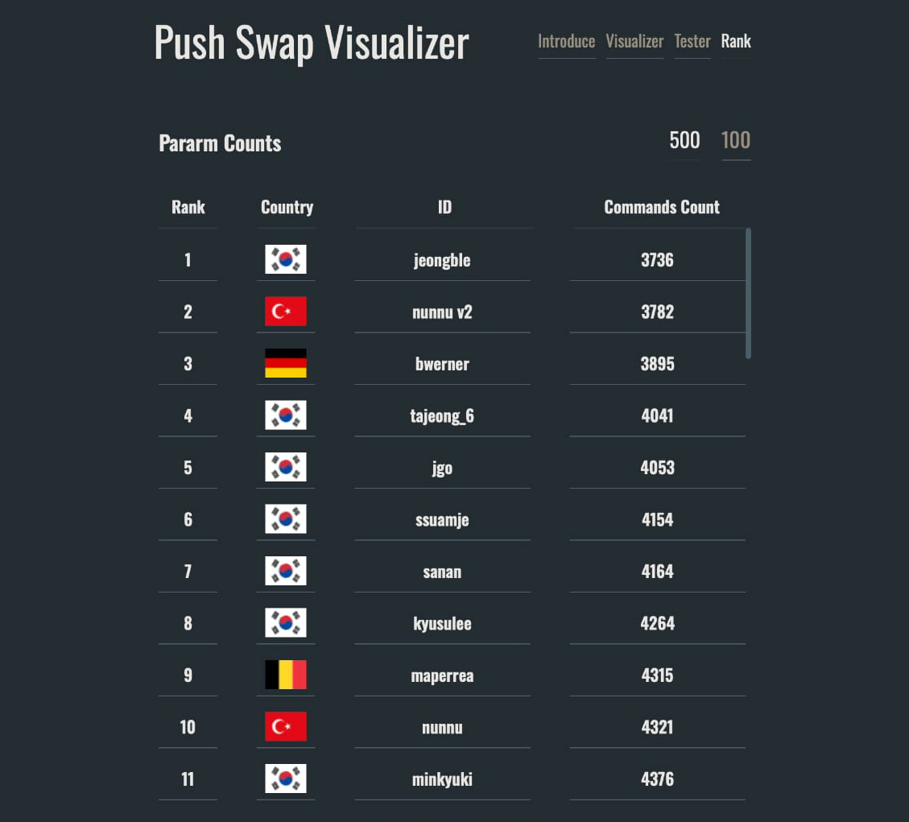

# Push_Swap'e hoş geldiniz

🚀 **Proje İsmi**: push_swap

👩🏻‍💻 **Yazar**: [Nisa Ünnü](https://www.linkedin.com/in/nisaunnu/)

---

### 🧠 Konsept:
Push_Swap, sınırlı sayıda talimatla ve mümkün olan en az sayıda eylem kullanılarak bir yığındaki verilerin sıralanmasını gerektiren algoritmik bir zorluktur. Başarılı olmak için çeşitli algoritma türlerini kullanmanız ve optimize edilmiş bir sıralama için en uygun olanı seçmeniz gerekir.

---

### ⚡️ Başarı:

Yazdığım yazılım sayesinde push_swap projem dünyada sıralamaya girmiştir! 

İşte başarı sıralamaları:
- 500 sayıyı sıralarken kullanılan ortalama min hamle sayısı: 3773

---

### 🚀 Optimum Algoritma Füzyonu:

- `push_swap`: Quick sort ve radix sort ilkelerini ve öbek tabanlı iyileştirmeyi kullanarak sıralama stratejisini veri boyutuna göre uyarlar.

**Sıralama Seçeneklerine Hızlı Bakış**
push_swap, değişken boyutlu diziler için QuickSort'un etkili bölümleme ve yığın tabanlı sıralamasının benzersiz bir karışımını kullanır. Bu çok yönlü taktik, push_Swap görevlerindeki çeşitli senaryolarda performansı optimize eder.

| Algoritma       | En Kötü  | Ortalama  | En İyi    | Algoritma için İdeal                     |
|-----------------|----------|-----------|-----------|------------------------------------------|
| Bubble Sort     | O(n^2)   | O(n^2)    | O(n)      | Küçük, basit listeler                    |
| Insertion Sort  | O(n^2)   | O(n^2)    | O(n)      | Küçük, istikrarlı listeler               |
| ...             | ...      | ...       | ...       | ...                                      |
| QuickSort       | O(n^2)   | O(n log n)| O(n log n)| Büyük listeler, hızlı ortalama vakalar   |
| Radix Sort      | O(nk)    | O(nk)     | O(nk)     | Tamsayı, karşılaştırmasız sıralama.      |

Benimsenen yaklaşım yalnızca QuickSort'un hızlı ortalama vaka çözümünü yakalamakla kalmıyor, aynı zamanda daha büyük setler için sistematik bir süreç getirerek Push_Swap programının ödün vermeden en yüksek verimliliği sürdürmesini sağlıyor.

---

### 🧩 Algoritma Şemaları:
- mandatory: [push_swap](algorithm/push_swap_algorithm.md)
- bonus: [checker](algorithm/checker_algorithm.md)

---

### 🎯 Test:

- Sıralama algoritmasının çıktısını doğrulamak için checker_Mac özelliğini kullanın.

- **Tester kullanın**: Sıralama başarısını, "Error" yazımının  tespitini, memory leaks kontrolünü ve diğer test kontrollerini gerçekleştirmek için push_swap tester'ları kullanın.
	* [Push Swap Tester - 1](https://github.com/laisarena/push_swap_tester)
	* [Push Swap Tester - 2](https://github.com/LeoFu9487/push_swap_tester)

- **Push_Swap'inizi Görselleştirin (Virtualization)**: Sıralamanızı adım adım veya otomatik olarak görselleştirmek/sanallaştırmak için program kullanın.
	* [Push Swap Visualizer](https://github.com/o-reo/push_swap_visualizer)
	* [42Barcelona - Push Swap Pro Checker](https://github.com/ailopez-o/42Barcelona-PushSwap-ProChecker)

  
