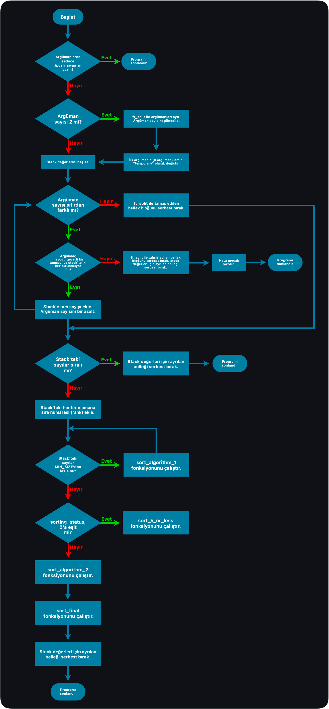
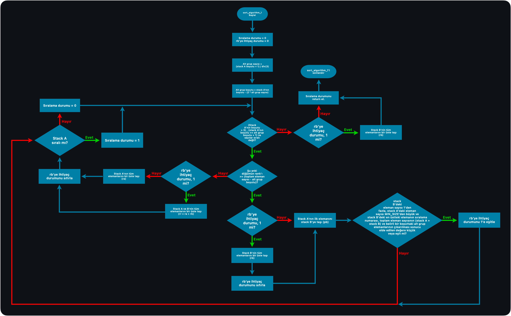
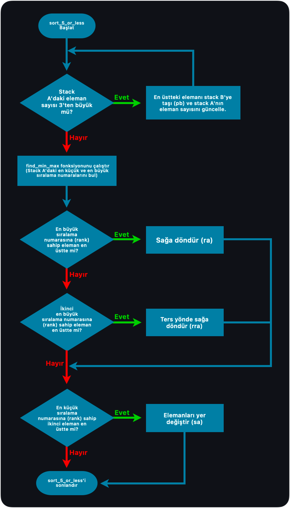
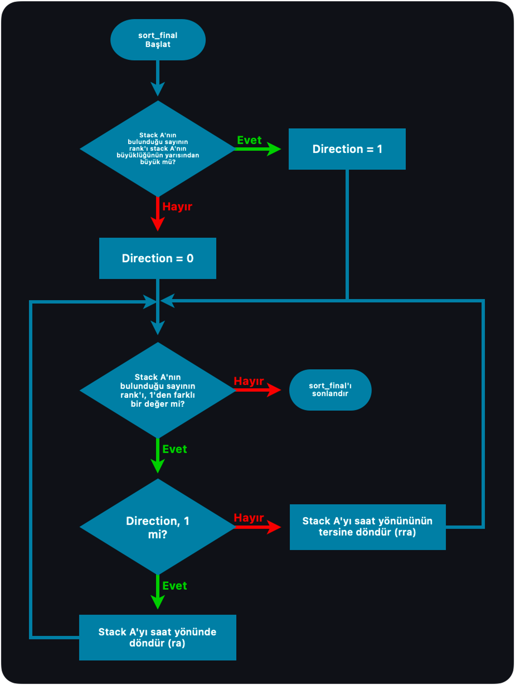

### `Push Swap` Algorithm
---

<html lang="en">
	<head>
		<meta charset="UTF-8">
		<meta name="viewport" content="width=device-width, initial-scale=1.0">
	</head>
	<body>
		

			
		

	</body>
</html>

  

### `sort_algorithm_1` Algorithm
---

<html lang="en">
	<head>
		<meta charset="UTF-8">
		<meta name="viewport" content="width=device-width, initial-scale=1.0">
	</head>
	<body>
		

			
		

	</body>
</html>

  

### `sort_5_or_less` Algorithm
---

<html lang="en">
	<head>
		<meta charset="UTF-8">
		<meta name="viewport" content="width=device-width, initial-scale=1.0">
	</head>
	<body>
		

			
		

	</body>
</html>

  

### `sort_final` Algorithm
---

<html lang="en">
	<head>
		<meta charset="UTF-8">
		<meta name="viewport" content="width=device-width, initial-scale=1.0">
	</head>
	<body>
		

			
		

	</body>
</html>

  
